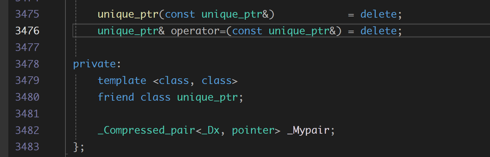
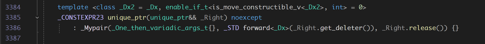

**关于unique_ptr**

特点：

- 独占有所权， 禁止复制构造， 禁止赋值运算符
- 32位程序下, sizeof(unique_ptr) == 4
- 64位程序下, sizeof(unique_ptr) == 8
- 类里面只有一个 Ty* 类型的变量 

unique_ptr内部只有一个指针类型的变量，该变量在栈上， 里面存放的是保存在堆上的资源的地址，当对象被析构时，自动释放堆内存。

### 一些问题

1. std::vector\<std::unique_ptr<int>>的使用会不会造成内存泄漏？

不会, unique_ptr实现了 移动构造函数，并且声明为 noexcept

当vector扩容时， 只会调用移动构造函数在一块新的内存上把 unique_ptr内部指针变量的值拷贝过来而已， 将原指针置为null_ptr, 不会涉及堆内存的操作。只有在析构函数中，才会释放内存

